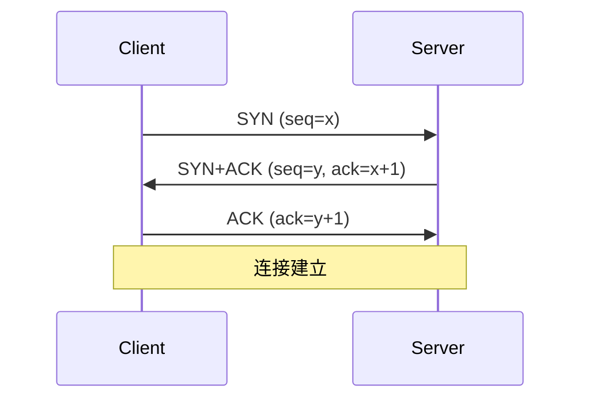
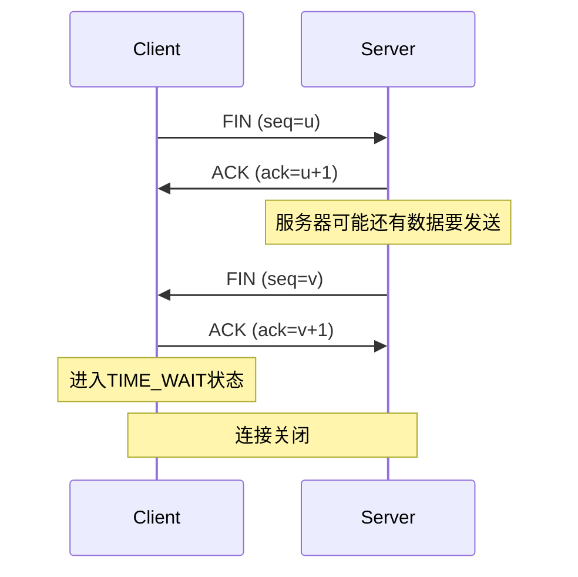
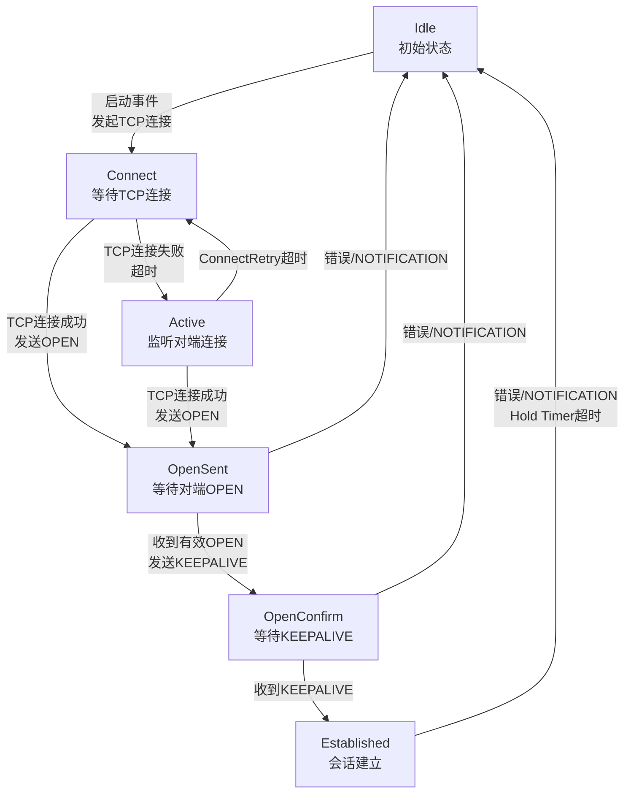

# Protocols&Network Summary

本文档主要总结协议相关的内容，主要是准备**网络和协议**相关的内容。

## 网络整体

#### OSI模型下每层常见的协议有哪些？

具体内容会在协议八股文内介绍，此外会有详细的协议的介绍。如果时间充足的话。

应用层：HTTP/HTTPS，DHCP

表示层：TLS/SSL

会话层：RPC，SSH

传输层：TCP,UDP

网络层：IP,ICMP,OSPF/BGP,ARP,IPsec

数据链路层：Ethernet,WiFi，VLAN，HDLC

物理层：IEEE 802.3

#### 大端序和小端序是什么？

大端序和小端序是计算机中数据在内存中存储的两种字节顺序。其核心区别在于多字节数据（如 int, long）的字节布局顺序。

- 大端序（Big-Endian）：数据的高位字节存储在低地址。
  - 特点：符合人类阅读习惯（高位在前）。
  - 应用：网络传输协议（TCP/IP）规定使用大端序，因此也称为网络字节序。
- 小端序（Little-Endian）：数据的低位字节存储在低地址。
  - 特点：便于计算机进行数学运算（低位地址对齐）。
  - 应用：大多数 X86、ARM 架构 CPU 默认使用小端序，也称为主机字节序。

判断方法（C++）：
可以通过联合体（union）或指针强转来判断。例如，将 0x01 存入一个 int，检查首个字节地址处的值。若为 0x01 则为小端，若为 0x00 则为大端。

#### 同一子网内的两台设备通信过程？

以主机 A 发送数据给主机 B 为例：

1. 判断同子网：主机 A 利用自己的子网掩码与目标 IP 进行与运算，判断主机 B 是否在同一网段。
2. ARP 解析 MAC：
   - 查表：主机 A 检查本地 ARP 缓存。
   - 请求：若无 B 的 MAC 记录，则发送 ARP Request 广播包。
   - 响应：主机 B 收到广播后单播回复 ARP Reply，告知自己的 MAC 地址。同时，交换机在此过程中学习 A 和 B 的 MAC 与端口对应关系。
3. 封装报文：主机 A 获取 MAC 后，封装数据帧。源 IP/目的 IP 为 A/B，源 MAC/目的 MAC 为 A/B。
4. 交换机转发：
   - 交换机接收数据帧，根据目的 MAC 查找 MAC 地址表。
   - 命中则将报文从对应端口单播转发给主机 B；若未命中（极少见），则进行泛洪。

#### 不同网段内的两台设备通信过程？

以主机 A 发送数据给主机 B 为例（不在同一网段）：

1. 判断跨网段：主机 A 计算发现主机 B 位于不同网段，需通过“默认网关”转发。
2. 主机 A 发送至网关：
   - ARP 解析网关 MAC：主机 A 查表或通过 ARP 请求获取网关（路由器接口）的 MAC 地址。
   - 封装数据帧：源 IP 为 A，目的 IP 为 B（始终不变）；源 MAC 为 A，目的 MAC 为网关 MAC。
   - 交换机转发：本地交换机根据目的 MAC 将帧转发给路由器。
3. 路由器三层转发：
   - 解封装与查表：路由器剥离旧的 MAC 帧头，根据目的 IP 查找路由表，确定转发接口。
   - ARP 解析目的主机 MAC：若路由器 ARP 表中无 B 的 MAC，则在目标网段发送 ARP 请求。
   - 重新封装：源 MAC 变为路由器出接口 MAC，目的 MAC 变为主机 B 的 MAC。
4. 最终交付：数据帧通过 B 所在网段的交换机，根据目的 MAC 最终交付给主机 B。

核心点：跨网通信过程中，源/目的 IP 保持不变，而源/目的 MAC 在经过网关（三层设备）时会被重新封装。

## TCP

#### TCP三次握手和四次挥手，为什么这么设计？

- 三次握手：在建立TCP连接时，client客户端向server服务器端发送一个SYN（同步）标志的数据包，服务器端收到后回复一个SYN和ACK（确认）标志的数据包，表示接收到了客户端的请求，并同意建立连接，最后客户端再发送一个ACK标志的数据包，表示连接已经建立。这样就完成了三次握手，建立了连接。
- 四次挥手：在终止TCP连接时，一方（假设是客户端）向另一方（服务器端）发送一个FIN（结束）标志的数据包，表示要关闭连接，另一方收到后会回复一个ACK标志的数据包，表示收到了关闭请求。然后另一方再发送一个FIN标志的数据包给第一方，表示同意关闭连接，最后第一方再发送一个ACK标志的数据包，表示接收到了对方的关闭请求。这样就完成了四次挥手，终止了连接。
  三次握手时序图：

四次挥手时序图：

#### TCP如果出现三次挥手是什么情况，会有什么影响？

当第四次挥手（Client的ACK）丢失或Server未收到ACK时，会出现三次挥手的情况。
三次挥手的影响：

- Server端资源泄露,最终导致端口耗尽，无法提供服务。
- 后续连接异常
- 数据传输错误

#### TCP三次握手的原因是什么？

TCP三次握手是建立可靠网络连接的**核心机制**，原因有三个：

- 防止历史连接初始化(核心原因)
- 同步双方初始序列号：为数据包提供有序标识，解决乱序、重复、丢包问题
- 避免资源浪费

#### TCP的拥塞控制算法有哪些，请你详细介绍这些算法？

TCP的拥塞控制算法从远到近主要有：慢启动，拥塞避免，快重传，快恢复，CUBIC​算法，BIC算法，Vegas​算法，Veno​算法，BBR算法

- 慢启动：初始阶段以指数级增长探测网络容量，避免突发流量冲击。指数增长易导致突发丢包，尤其在高带宽网络中。
- 拥塞避免：线性增长cwnd，避免过度占用带宽。平衡网络负载，避免拥塞恶化。
- 快重传：通过重复ACK快速检测丢包，避免等待超时。连续收到3个重复ACK就会触发。
- 快恢复：避免因单个丢包直接回到慢启动，维持较高传输效率。
- CUBIC算法：使用三次函数替代线性增长，高带宽网络中更平稳，Linux默认算法。
- BIC算法：二分搜索寻找最大可用带宽，通过增/减窗口逼近平衡点。适用于长距离高速网络。
- Vegas算法：通过RTT变化预测拥塞。若实际吞吐量低于预期，减小cwnd。与基于丢包的算法竞争时处于劣势。
- Veno算法：丢包事件 → 触发快重传 → cwnd减半 → 进入快恢复 → 收到新ACK后退出恢复。结合丢包和延迟信号，区分无线丢包与真实拥塞丢包。适用于无线网络。
- BBR算法：基于带宽和延迟估计，主动避免缓冲区膨胀

#### 如何解决TCP的粘包?

TCP是面向字节流的协议，无消息边界。粘包常用**解决方法**：

- 特殊分隔符：在消息末尾添加特定字符（如换行符），接收方根据分隔符拆分。需对内容中的分隔符进行转义。
- 固定长度：约定每个数据包长度固定，不足则填充。适用于消息大小波动小的场景，但传输效率相对较低。
- 消息头字段：在消息头部封装固定长度的字段来表示载荷长度。接收方先解析头部获取长度，再读取后续数据。这是最通用、高效的方案。
- 应用层协议：直接使用HTTP、MQTT等已在应用层定义好消息边界的成熟协议。

#### TCP挥⼿过程中，为什么需要存在TIME_WAIT状态？

TIME_WAIT状态由主动关闭连接的一方进入，持续时间通常为2MSL。

原因如下：

- **防止历史连接报文干扰新连接**：2MSL的时间足以让旧连接产生的所有报文在网络中消失。如果不等待直接建立新连接（相同四元组），残留在网络中的旧报文可能被误认为新连接的数据，导致逻辑错误。

- **确保被动关闭方正常关闭**：主动关闭方最后发送的ACK可能丢失。若丢失，被动关闭方会重传FIN。主动关闭方必须维持TIME_WAIT以重发ACK。如果直接关闭，被动关闭方因收不到ACK会一直重传FIN，导致无法进入CLOSED状态。

#### 如何解决大量TIME_WAIT 状态的问题?

应根据场景（客户端还是服务端）采取不同策略：

- 开启内核参数 tcp_tw_reuse：在 Linux 中设置 net.ipv4.tcp_tw_reuse = 1，允许将处于 TIME_WAIT 状态的句柄重新用于新的出站连接（仅限客户端）。
- 使用长连接/连接池：在应用层开启 HTTP Keep-Alive 或使用数据库连接池，减少连接的频繁创建和销毁，从根源减少 TIME_WAIT 的产生。
- 设置 SO_REUSEADDR：服务端程序常用选项。允许服务器在重启时立即绑定仍处于 TIME_WAIT 状态的端口，避免出现“Address already in use”错误。
- 强制关闭（SO_LINGER）：通过设置套接字选项，在关闭时直接发送 RST 报文跳过四次挥手。这属于暴力手段，可能导致数据丢失，需谨慎使用。
- 调整 MSL 值：减小内核中的 MSL 时间可以缩短 TIME_WAIT 持续时间，但在网络不稳定的情况下可能导致旧报文干扰新连接。

## ARP

#### free ARP和ARP的区别？

ARP：解析目标IP对应的MAC地址

- 发送ARP Request（以太网帧目标MAC为广播，ARP报文目标MAC为全0，目标IP为待解析地址）
- 收到ARP Reply后更新ARP表项

free ARP（免费ARP）：检测IP冲突或通告MAC变更

- 源IP和目标IP都填本机IP，目标MAC为广播
- 若收到Reply则存在IP冲突
- 也用于主动通告本机MAC变化，更新其他设备ARP缓存

#### ARP 欺骗是什么，如何防范？

ARP欺骗是一种网络攻击手段，通过伪造IP-MAC映射关系，导致数据被劫持或网络中断，在界面上的表现为本来通信的双方通信时断时续。这个问题可以从三个角度来回答：

- 网络设备层防御：开启ARP表项固化，在学习到合法表项后将其与端口绑定，防止后续非法更新。开启ARP严格学习，校验报文的入接口、VLAN等信息。在更新表项前发送ARP请求进行双向验证，确认变更合法。开启ARP报文深度检查，校验以太帧头部和ARP报文内容的一致性。也可以使用IPsec等协议建立安全隧道，确保通信可靠。
- 网络架构优化：划分VLAN缩小广播域，采用交换机端口安全绑定，或通过PPPoE认证等机制替代传统ARP环境。
- 终端防护措施：静态ARP绑定，安装ARP防火墙

## ICMP

#### 什么是ICMP协议?

ICMP（网际控制报文协议）是网络层协议，用于在IP主机和路由器之间传递控制消息，包括网络诊断和错误报告。

应用场景：

- 网络诊断：ping利用ICMP回显请求与应答评估连接质量；traceroute利用ICMP超时报文追踪数据包路径。
- 错误报告：当路由器或主机无法交付数据包时，会发送“目的地不可达”等ICMP消息，帮助排查网络故障。

通信过程：首次ping目标主机时，若本地ARP表无对应映射，会先触发ARP协议解析MAC地址。解析成功并更新ARP表后，ICMP报文方可封装发送。ICMP分为ICMPv4和ICMPv6，分别对应IPv4和IPv6。

## QUIC

#### QUIC协议解决了TCP的什么问题，QUIC协议的特性？

TCP问题：

- 队头阻塞：序号连续机制导致丢包时后续包必须等待重传
- 握手延迟：TCP 1-RTT + TLS 2-RTT = 3-RTT
- 协议僵化：内核实现，中间设备固件难更新

QUIC特性（基于UDP在应用层实现）：

- 0-RTT快速连接：首次连接1-RTT，后续连接缓存密钥实现0-RTT
- 连接迁移：用Connection ID标识连接（而非四元组），网络切换时连接不中断
- 无队头阻塞的多路复用：每个Stream独立传输，单Stream丢包不影响其他Stream
- 双级别流控：Connection级别 + Stream级别分别控制
- 可插拔拥塞控制：应用层实现，无需修改内核

## BGP

#### BGP协议的作用？

BGP是Path Vector协议，用于**AS间交换路由可达性信息**。

核心功能：

- AS间路由交换：eBGP在AS间传递路由，iBGP在AS内同步路由
- 策略路由控制：通过属性（如Local Preference、MED）影响选路
- 可靠传输：基于TCP 179端口，增量更新而非周期性全量更新
- 大规模扩展：支持全球互联网规模的路由表

#### BGP状态机？

BGP状态机有6种

- Idle：BGP的初始状态。BGP进程正在等待一个启动事件。此时，BGP拒绝任何进入的连接尝试，并不主动尝试建立TCP连接。
- Connect:BGP正在等待其主动发起的TCP连接（端口179）完成建立
- Active:BGP未能成功建立其主动发起的TCP连接，转为监听对端发起的TCP连接请求。
- OpenSent：TCP连接已成功建立，BGP已经发送了自己的 OPEN 消息，现在正在等待接收对等体的 OPEN 消息。
- OpenConfirm：BGP已经成功交换了 OPEN 消息（参数协商成功），并且已发送了 KEEPALIVE 消息，现在正在等待接收对等体的 KEEPALIVE 或 NOTIFICATION 消息。
- Established：BGP对等体会话的最终、稳定工作状态。

#### 为什么需要MP_BGP扩展？

MP-BGP（Multi-Protocol BGP）将BGP从IPv4单播升级为通用多协议路由分发平台。
原因：

- BGP-4的NLRI、NEXT_HOP等字段绑定IPv4格式，无法承载IPv6、VPN等路由信息

**解决方案**：

- 引入AFI（地址族标识符）和SAFI（子地址族标识符）区分不同协议类型
- 新增MP_REACH_NLRI和MP_UNREACH_NLRI属性携带多协议路由信息
- 支持IPv6单播/组播、L2VPN、L3VPN等多种地址族

#### 没有引入MP_BGP之前支持哪几种协议？

RFC4271传统BGP-4仅支持IPv4单播路由（AFI=1, SAFI=1）。

MP-BGP扩展后支持的常见地址族：

| AFI  | SAFI | 类型                   |
| ---- | ---- | ---------------------- |
| 1    | 1    | IPv4单播               |
| 1    | 2    | IPv4组播               |
| 1    | 128  | IPv4 VPN（MPLS L3VPN） |
| 2    | 1    | IPv6单播               |
| 2    | 2    | IPv6组播               |
| 2    | 128  | IPv6 VPN               |
| 25   | 65   | L2VPN EVPN             |

#### BGP是否产生路由，如何产生路由？

BGP**路由来源**有2种：

- 本地注入
  - network命令：手动将本地路由表中已存在的路由注入BGP（需精确匹配）
  - 路由重分发：将IGP（如OSPF）计算的路由导入BGP进程
- 邻居学习：通过`UPDATE`报文从BGP peer接收路由

#### BGP路由源是什么？

BGP的origin字段的取值一共有3个选项：

- 1：代表IGP，该路由是通过BGP的 network 命令 从路由器的本地IP路由表中精确匹配注入的

- 2：代表EGP，该路由是通过EGP协议（Exterior Gateway Protocol）学习到的。现已经被淘汰。

- 3：Incomplete，该路由是通过路由重分发（Redistribution） 方式引入BGP的。

#### network报文和BGP协议引入路由的报文的区别？

- network命令：本地配置，将路由表中已存在的路由注入BGP，origin属性为IGP

- UPDATE报文：BGP对等体之间传输路由的协议报文，携带路由属性（AS_PATH、NEXT_HOP等），origin属性继承原值

#### update报文里面的属性有哪几类？公认必遵属性有哪些？

BGP路由属性有四类：

- 公认必遵（必须识别、必须传递）：ORIGIN、AS_PATH、NEXT_HOP
- 公认自决（必须识别、自行决定传递）：LOCAL_PREF
- 可选传递（可不识别、需传递）：COMMUNITY、AGGREGATOR
- 可选非传递（可不识别、不传递）：MED、ORIGINATOR_ID、CLUSTER_LIST

## HTTPS

#### HTTPS是如何进行加密的？

HTTPS 采用混合加密机制，结合了对称加密的高效和非对称加密的安全。

核心原理：

- 身份验证：通过数字证书和 CA（证书颁发机构）验证服务器身份，防止中间人攻击。
- 密钥交换：在握手阶段利用非对称加密（如 RSA 或 ECDHE）安全地协商出对称加密所需的会话密钥。
- 数据传输：通信开始后，使用对称加密（如 AES）对实际数据进行加解密。
- 摘要算法：利用哈希算法（如 SHA-256）确保数据完整性，防止被篡改。

TLS 握手核心流程：

1. Client Hello：客户端发送支持的协议版本、密码套件和随机数。
2. Server Hello：服务端确认协议、密码套件，并发送随机数和数字证书。
3. 证书验证：客户端验证证书合法性，从中获取服务端公钥。
4. 密钥交换：客户端生成预主密钥，用公钥加密发送给服务端（或通过 DH 交换），双方根据之前的随机数计算出相同的会话密钥。
5. 完成：双方互发 Finished 消息，后续数据正式切换至对称加密。

#### HTTP Keep-Alive 的实现原理

HTTP Keep-Alive（持久连接）用于实现 TCP 连接的复用，减少频繁建立和销毁连接的开销。

**核心机制**：

- 协议支持：在 HTTP/1.0 中需在头部显式加入 Connection: keep-alive；在 HTTP/1.1 中默认开启持久连接，除非指定 Connection: close。
- 连接复用：服务器在发送响应后不立即关闭 TCP 连接，而是维持打开状态。后续请求可在同一连接上串行发送。
- 资源控制：
  - Keep-Alive Timeout：空闲一段时间后（如 15 秒）服务器会自动断开连接，防止资源浪费。
  - Max Requests：限制单个连接上可处理的最大请求数。

注意区分 TCP Keepalive：

- HTTP Keep-Alive：应用层机制，目的是复用连接。
- TCP Keepalive：传输层机制，目的是保活探测（检测死连接）。