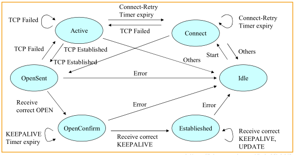
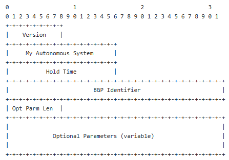
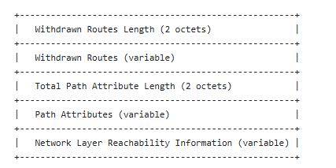
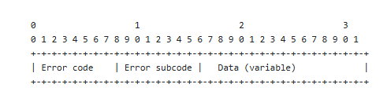

# RFC4271

摘要：定义 BGP-4 协议基础

BGP协议的主要功能是与其他BGP系统交换网络可达性信息。
网络可达性信息包括可达性信息所遍历的自治系统(AS)列表上的信息。这些信息足够构建AS网络拓扑连接图，从中可以修剪路由循环。而且在AS级别，可以强制执行一些路由策略。

BGP4协议还提供了一种CIDR(支持无类域间路由)机制,减少路由表条目的转发，降低路由表的规模，缓解BGP的会话带宽压力。IPv4地址有ABC类地址之分，BGP4协议也一起摒弃了。BGP4协议还引入了路由聚合和AS聚合的机制，后面会讲。

**CIDR机制**：多个连续的IP地址块聚合成一个​CIDR前缀，减少路由表条目，降低路由表规模，缓解BGP会话的带宽压力。

## 1.介绍

BGP协议仅支持基于目的地址的转发范式，这一设计从根本上限制了其可实施的路由策略类型。
BGP报文转发决策流程：
BGP路由器根据目的地址匹配路由表中的前缀，选择最优路径（如最短AS_PATH或最高LOCAL_PREF），并将数据包转发给下一跳。​整个过程**仅依赖目的地址**，与数据包的其他属性无关。

### 1.1常用术语的定义

本节主要介绍一些专业术语。
RIB_in:路由输入，即外部输入到本ASspeaker的路由表信息。
RIB_out:路由输出，即内部输出到其他ASspeaker的路由表信息。
AS:自治系统，​单一技术管理实体下的一组路由器，这些路由器使用​内部网关协议（IGP）和​共同度量标准进行内部路由，同时通过​外部网关协议与其他AS通信。AS对外表现为​单一路由策略实体。
BGP ID：BGP 标识符是BGP协议中用于唯一标识一个BGP Speaker的4字节无符号整数，**为BGP会话提供设备级唯一性保证**。
BGP speaker：BGP发言者，实现BGP协议的路由器。
EBGP:外部网关路由协议，是运行在不同自治系统（AS）之间的BGP实例，其核心功能是实现跨AS的路由信息交换与策略控制。
IBGP:内部网关路由协议，是运行在同一个自治系统（AS）之内的BGP实例，其核心功能是实现AS内部的路由信息交换与策略控制。
External peer：外部对等体，与本地AS不同的另一个对等体。
Internal peer：内部对等体，处于同一AS内的另一个对等体。
local_RIB:包含本地BGP speaker决策过程选择的路由表。
NLRI:网络层可达性信息。
route:路由是网络通信中**决定数据包从源地址到目的地址传输路径的核心机制**，其本质是将目标网络与路径属性绑定的信息单元。
RIB：路由表，又称路由信息库。
Unfeasible route：不可行路线，以前公布的不再可用的可行路线。

### 1.2. 需求说明

RFC文档中的各个要求是不一样的，从MUST到OPTIONAL等级从高到低。

## 2.致谢

略过

## 3.业务概要

边界网关协议（BGP）是一种自治系统间路由协议。
**BGP 发言者仅通告自身实际使用的路由**是路由协议的**核心机制**，本质是路径优选和策略过滤的结合。
可以通过源路由(显式路由)实现指定路径的报文转发。也可以使用策略路由调整报文流量的方向。但是会有**潜在的路由环路和路由黑洞**的问题。
BGP协议使用TCP协议作为其传输协议，使用固定端口179在peer间建立可靠的TCP传输连接。依靠TCP协议，BGP能够保证在连接关闭前将所有报文传输完成。
一般是在两个系统之间建立TCP连接并交换报文信息打开和确认参数。

初始数据流是经过路由策略过滤之后的路由表的一部分，一般通过update报文将有效路由更新到路由网络中。
在TCP连接过程中，BGP speaker会保留所有的当前路由，除非收到update报文。
BGP有keepalive报文保活机制，如果这个选项设置为0则认为关闭该机制。如果连接遇到错误情况，BGP peer将发送通知消息并关闭连接。
内部BGP和外部BGP通常缩写为IBGP和EBGP。

如果一个AS内有多个BGP speaker，此时该AS为其他AS提供中转服务，**需要确保AS内的路由视图是一致的**。由此解决外部路由的认知不一致带来的路由黑洞问题。

### 3.1路由：广告和存储

路由=目标网络前缀​+​路径属性
目标网络前缀：标识路由的终点范围，接收方根据此信息更新本地路由表。
路径属性：控制路由选择、防止环路、实现策略路由。
注意：根据RFC4271，**路由属性分为4种级别**

- 公认必遵：所有 BGP 设备必须识别且必须存在于 Update 报文中，缺少则路由无效，有Origin、AS_Path、Next_Hop
- 公认任意：所有BGP设备必须识别，update报文中可有可无，缺少不影响路由有效性。有Local_Pref、Atomic_Aggregate
- 可选过渡：设备可不识别但必须转发给邻居，支持跨AS传递。有MED、Community、Aggregator
- 可选非传递：设备可不识别且不转发给邻居，仅本地生效。

在BGP peer的对等体广播之前，BGP peer可以修改除了公认必遵之外的三种级别的路由属性，修改路由属性。

BGP**通知路由不可用**的3种方法：

- 发送路由撤销（Withdrawal）消息：当路由失效时，BGP speaker生成​UPDATE报文，在Withdrawn Routes字段中列出不可达路由的前缀,对端peer从路由表中删除该路由表项。
- 更新路由属性标记不可达：在 UPDATE 报文中，对不可达路由的路径属性进行修改，将 NEXT_HOP 设置为无效地址。
- 路由抑制（Dampening）机制：对频繁震荡的路由启动BGP抑制计时器。每次路由变化增加惩罚值，超过阈值后，路由被抑制且不再通告，但是**仍然可以被撤销**。

### 3.2 路由表

RIB=RIB_in+local_RIB+RIB_out

BGP 通过​Adj-RIBs-In、Loc-RIB​和​Adj-RIBs-Out​实现路由的接收、决策和转发控制，而​路由表作为最终执行层，整合所有路由来源并决定实际数据路径。

**路由表的组成**​：
包含所有用于数据转发的路由，包括：
直连网络（Direct）
静态路由（Static）
IGP 路由（如 OSPF、IS-IS 学习的路由）
BGP 路由（从 Loc-RIB 安装的最优路由）

## 4.消息格式

BGP报文的长度为19-4096字节，按大端序传输。

### 4.1消息头格式

BGP报文的报文头是19个字节
BGP报文头=16字节marker字段(未使用认证默认全为1)+2字节length字段+1字节type字段
注意：
marker字段如果启动了认证功能，将不为全1。
length字段即表示本报文的长度
type字段即1 - OPEN开启 2 - UPDATE更新 3 - NOTIFICATION通知 4 - KEEPALIVE保活

### 4.2 open报文格式

状态机从idle切到connect，会发送open报文

open报文的**最短长度**=19+1+2+2+4+1=29字节

- version：1字节，表示当前BGP协议版本，通常使用BGP4，之前的BGP版本都已经被淘汰(顺便说一句，BGP4是BGP协议第四代的意思，和IP地址类型无关)
- my autonomous system:2字节,表示发送方的AS号
- hold time:2字节，保持时间，设置为0则不启用保活机制，设置≥3秒则设置有效的保活机制。
- BGP ID:BGP 标识符，4字节，使用IPv4的地址作为BGP ID。(插一句，一般选取BGP speaker的时候IP地址的优先级是环回地址IP>物理接口IP，且会选取点分十进制较大的IP)
- optional parameter：1字节，**可选的**，包含可选参数列表，其中每个参数都编码为<parameter Type，parameter Length，parameter Value>三元组。(翻译一下就是按TLV格式存储)如果为0则表示后续无可选参数。

### 4.3 update报文格式

update报文的最短长度=19字节报文头+2字节Withdrawn Routes Length+2字节Total Path Attribute Length=23字节

update报文用于在BGP peer之间传输路由信息，路由信息可以构建路由拓扑图。
路由环路和路由黑洞这些路由问题可以通过update报文实现故障消除。

update报文用于向对等方公布共享公共路径属性的可行路由，或从服务中撤回多个不可行路由。update报文可**同时公布**可行路由并从服务中撤回多个不可行路由，报文始终包括**固定大小**的BGP标头，还包括其他字段

Withdrawn Routes Length：撤销路由长度，2字节，表示后面撤销路由的数目。如撤销3条路由，该字段的值就是3*2=6
Withdrawn Routes：撤销路由，Withdrawn Routes字段的编码格式为<Length, Prefix>。举个例子，10.0.0.0/8长度为8，那么他的length就是8，他的prefix的值就是length/8=8/8=1，**截断**编码表示就是08 0A
Total Path Attribute Length：路径属性总长度，2字节，表示后面发布路由的数目。
Path Attributes：发布路由，每个路径属性都是长度可变的三重<attribute type，attribute length，attribute value>

- type：1字节，第一个字节定义属性是可选的还是公认的(公认属性设置为0)，第二个字节是可传递位，可传递的属性设置为1。
  
注意：

| 路由属性分类       | 可选位 (Optional) | 过渡性 (Transitive) | 完整位(Partial bit)    |
|:-------------------|:------------------|--------------------|:-----------------------|
| **公认必遵**       | 0                | 1                  | 0                   |
| **公认任意**       | 0                | 1                  | 0                   |
| **可选过渡**       | 1                | 1                  | 属性完整时设置为0    |
| **可选非传递**     | 1                | 0                  | 0                   |

type的第4个高位是扩展长度位。如果设置为0就是一个字节表示属性长度，为1则用2个字节表示属性长度。
第一个字节4个低位都设置为0。

路径属性的第二个字节表示属性值：

- origin：值为1，3字节，TLV格式，**公认必遵**属性
- AS_PATH:值为2，头部2字节 + 可变Value，**公认必遵**属性
- NEXT HOP:值为3，1+1+4总共6字节，**公认必遵**属性
- MULTI_EXIT_DISC：值为4，**可选非传递**属性，又称MED，越小路由优先级越高。1+1+4总共6字节
- LOCAL_PREF：值为5，本地优先，**公认任意**属性，1+1+4总共6字节
- ATOMIC_AGGREGATE：值为6，**公认任意**属性，2字节
- AGGREGATOR：值为7，**可选传递**属性，1字节type+1字节length+2字节AS号+4字节IP地址

NLRI网络层可达信息是路由更新的核心字段，用于明确通告可达的网络前缀及其属性。
格式​：<Length (1字节), Prefix (可变长度)>
length：前缀的掩码长度（0~32位，IPv4；0~128位，IPv6）。
Prefix​：网络地址的二进制表示（长度由Length字段决定）。

### 4.4 keepalive保活报文消息格式

KEEPALIVE的长度为19个八位字节。
keepalive报文的发送频率一般是hold time字段的1/3，如果设置为0则不使用keepalive保活机制。

### 4.5 notification报文格式

当检测到错误情况时，将发送notification报文，BGP连接在发送后立即关闭。

notification报文最短长度=19+1字节错误码+1字节子错误码
data是可选项，此可变长度字段用于诊断通知的原因。
具体类型不再赘述。

## 5.路径属性

路径属性分为四大类：

- 公认必遵：**必须**能够识别，且**必须**存在于Update报文中
- 公认可选：必须识别，但**不强制要求**存在于Update报文中。
- 可选过渡：可不识别，必须传递
- 可选不过渡：可不识别，忽略该属性且**不传递给其他peer**

update报文的发送方需要按照type code升序构建报文，**为了兼容各方设备**接收方需要有接收type code乱序的能力。若接收方发现属性重复的update报文，则直接丢弃该报文。

### 5.1路径属性用法

#### 5.1.1来源origin

origin来源标识路由信息的来源，公认必遵。**值越小优先级越高**

- 0：IGP协议，IBGP协议或者network手动注入标记为0
- 1：EGP协议
- 2：incomplete不完整的，import route手动引入

#### 5.1.2 AS_PATH

AS_PATH**按顺序记录**路由经过的所有AS编号，公认必遵。

当BGP speaker向不同邻居传播路由时，AS_PATH的修改方式取决于邻居类型和策略配置​：

- 向EBGP邻居传播：在AS_PATH最左侧添加本地AS号
- 向IBGP邻居传播:保持原始路径

注意：
当BGP speaker发送路由信息时会把本地的AS号加到这个AS_PATH中。

#### 5.1.3 next hop下一跳

next hop下一跳记录路由信息下一个目的地，公认必遵。

next hop的**设置规则**：

- ​EBGP邻居间传播：下一跳属性设置为建立EBGP会话的接口IP地址(即使用自己的IP作为下一跳)
- IBGP邻居间传播：下一跳属性保持不变
- 本地始发路由：network命令注入则下一跳默认为0.0.0.0，后续替换为源IP地址。

next hop的**处理规则**：

- 单跳BGP:TTL=1,EBGP直接使用使用邻居接口IP作为下一跳.若IBGP邻居为直连，下一跳仍保持原始值,如果是使用多跳建立的IBGP会话需要配置最大跳数。
- 多跳BGP:EBGP或IBGP邻居通过中间设备建立会话.EBGP多跳则下一跳仍为建立会话的接口IP。IBGP多跳则下一跳默认保持原始值。

路由匹配原则：

- 1.先找**完全匹配**的路由，从上往下遍历，如果匹配上就使用。
- 2.找不到完全匹配就使用**最长掩码匹配**。
- 3.路由等价则根据**路由策略选择**

#### 5.1.4 MED

MED是一个可选非传递属性，用于EBGP连接间**选择最优路径**。MED值越小，路径越优。BGP设备**必须在路由选路流程的前两个阶段**​（优先级计算和路由选择）之前通过本地配置移除MED属性，否则可能影响选路结果。

#### 5.1.5 local_pref 本地优先

local_perf 本地优先是BGP的**公认任意属性**，用于在同一AS内部的IBGP对等体之间选择最佳出口路径。其值越大，优先级越高。
**内部传播**时若未显式配置，LOCAL_PREF默认为100
**外部传播**时不得带上local_perf,BGP Confederations场景除外。

#### 5.1.6 ATOMIC_AGGREGATE路由聚合

ATOMIC_AGGREGATE路由聚合是BGP的**公认任意属性**，用于标识一条路由是经过聚合的。
ATOMIC_AGGREGATE路由聚合的作用：明确告知接收方该路由是多个明细路由的汇总结果，可能丢弃了部分明细路由的细节。**不跨AS传递**。
路由聚合的origin字段取聚合的路由中的origin字段间的较大值。

#### 5.1.7 AGGREGATOR

AGGREGATOR聚合器是BGP的**可选过渡属性**​，用于标识聚合路由的生成者信息，包含聚合路由的AS号和生成该聚合路由的路由器ID。

AGGREGATOR聚合器的核心作用：

- 溯源聚合来源​：明确告知接收方该聚合路由是由哪个AS的哪台设备生成的。
- ​辅助防环与策略控制​：结合AS_PATH等属性，避免因聚合导致的环路或策略失效。

## 6.BGP 错误处理

如果BGP检测到错误会发送notification报文，并关闭BGP连接，错误子代码默认为0，data字段默认为空。

### 6.1 报文头错误处理

notification报文头=19字节+错误码+错误子码+数据data
marker字段不为全1，视为同步错误，错误子代码必须设置为Connection not Synchronized（连接未同步）。
以下是一些报文头错误的场景：

- 报文头长度小于19或者大于4096字节
- open报文小于29字节
- update报文小于23字节
- KEEPALIVE消息不是19字节
- notification报文小于21字节

这种场景下，notification报文的构成为19字节固定头部+1字节错误码+1字节错误子码+2字节data表示长度，比如说收到一个16字节的keepalive报文，data部分就是0x00 0x10，占用2个字节。

### 6.2 open报文错误处理

处理open报文时候如果是遇到错误的open报文，将错误码置为open message error，在错误子码说明详细的错误内容。
一种基本现网不使用的场景，仅做了解：
如果是版本不支持需要将错误子码设置为不支持的版本号，然后data部分就是当前支持的最新版本，比如BGP3，但是现在网络基本都是支持BGP4了，所以这个场景基本不存在了。

如果是AS字段不可接受，就把错误子码设置为Bad Peer AS。
Hold time ，BGP ID，optional parameters也有可能会出现错误。此处不再赘述。

### 6.3 update报文错误处理

update报文出现错误，错误码就是UPDATE message Error。update报文的错误检查从检查路径属性开始。
包含正确路径属性但没有NLRI的update报文应**视为有效**。

### 6.4 notification报文错误处理

如果peer发送notification报文，且报文接收方检测到该报文中存在错误，则接收方无法使用notification报文将此错误报告给发送方。此时会直接停止BGP连接，状态机回到IDLE初始状态。

### 6.5 Hold Time定时器过期错误处理

如果hold time定时器超时会导致BGP连接断开，保活机制失效。状态机回到IDLE初始状态。

### 6.6 状态机错误处理

当BGP状态机在非预期状态下收到错误的报文或事件时触发，如IDLE状态下收到update报文。

### 6.7 停止处理

BGP peer可以在不发生故障的任意时间发送Cease通知关闭BGP连接。

#### 前缀超限

Cease的定位​：用于**策略性中断**。
BGP设备可配置接收前缀数的上限阈值，超限时有两种处理方式：

- 静默丢弃新前缀：仅记录丢弃超限后的新前缀更新的日志
- 终止BGP连接：立即关闭连接，并发送notification报文给对端peer(此时发送cease)

### 6.8 BGP连接冲突检测

BGP连接冲突**产生条件**：
当两个BGP对等体（Peer）​同时向对方发起TCP连接请求​（目标端口均为179）时，会产生两条独立的TCP连接。

冲突**解决机制**：Router-ID仲裁

- 比较Router-ID大小​：数值较大的一端保留其发起的TCP连接，较小的一端关闭连接
- Router-ID生成规则​：采用顺序：手工配置的Router-ID>设备最大环回口IP地址>最大物理接口IP地址

## 7. BGP版本协商

(由于当前现网都使用BGP4协议了，该机制基本用不上)
BGP版本协商机制是协议设计中用于**动态确定两端设备共同支持的最高BGP版本**的过程，其核心逻辑是通过渐进式尝试和错误反馈实现高效协商。
过程如下：
A发送open报文，报文内是给告诉B自己支持的最高版本，B不支持的话会回一个notification报文给A，里面装有自己支持的最高版本，最后实现版本协商。

## 8. BGP状态机

BGP4协议根据有限状态机（FSM）指定BGP操作。

每个BGP连接**必需会话属性**包括：

- State状态
- ConnectRetryCounter连接重试计数器
- ConnectRetryTimer连接重试计时器
- ConnectRetryTime连接重试时间间隔
- HoldTimer保持计时器
- HoldTime 保持时间
- KeepaliveTimer保活报文发送计时器
- KeepaliveTime保活时间

BGP连接的**可选会话属性**包括：
邻居自动管理组：(控制BGP会话的自动启停与振荡抑制)

- AllowAutomaticStart：允许BGP会话自动启动
- AllowAutomaticStop:允许BGP会话自动启动
- DampPeerOscillations:抑制邻居振荡​（频繁断连重建）。

TCP连接控制组：(管理TCP连接的建立方式与状态跟踪)

- PassiveTcpEstablishment；强制BGP设备以被动模式建立TCP连接（仅监听179端口，不主动发起连接）
- TrackTcpState：精细跟踪TCP状态变化

消息处理组：(控制BGP消息的发送时机与方式)

- DelayOpen:延迟发送OPEN报文，等待对端先发送OPEN。
- DelayOpenTime:配置DelayOpen的等待时间​
- DelayOpenTimer:执行DelayOpen策略的**运行时计时器**，倒计时归零时触发DelayOpenTimer_Expires事件
- SendNOTIFICATIONwithoutOPEN:允许不发送OPEN报文直接发送NOTIFICATION

防抖与冲突处理组：(提升会话稳定性与冲突解决能力)

- IdleHoldTime:配置会话失败后等待重建的基准时间​
- IdleHoldTimer:执行IdleHoldTime的运行时计时器，归零后允许重新发起连接
- CollisionDetectEstablishedState:在Established状态仍检测连接冲突​
- AcceptConnectionsUnconfiguredPeers:允许接受未显式配置的邻居发起的BGP连接。

本章主要记录的是一些很具体的状态机如何切换时的内部信息，如果要做协议实现的时候可以来这一章看下。其余内容不做赘述。

## 9. update报文处理

只能在已建立状态下接收update报文。在任何其他状态下接收都是错误的行为。

update报文进行路由决策的**核心流程**分为2个阶段：**输入处理阶段、最佳路径选择阶段**

### 9.1 输入处理阶段

此阶段在接收Update报文后、正式选路前完成，核心任务是**路由的初步过滤与属性处理**，确保路由合法有效后才参与后续选路。(确保**策略灵活性**)
具体步骤：

- 1.报文验证与解析：格式校验，属性合规校验，防环检查
- 2.路由存储与策略过滤：有效路由暂存于Adj-RIB-In表，应用输入策略
- 3.​路由注入与撤销处理：将NLRI中的新路由加入候选集，移除失效路由，并触发本地路由表更新。

### 9.2 最佳路径选择阶段

BGP从候选路由中按11步优先级规则逐层筛选最优路径，仅最优路由加入路由表并通告给邻居。前6步基于路径属性，后5步依赖拓扑与配置。(确保**选路一致性**)

### BGP 最佳路径选择决策流程表

最佳路径选择流程如下，**优先级从高到低**：

- 下一跳可达性：路由的下一跳地址必须在本地路由表中可达。
- 同步状态检查（可选）：若启用了BGP同步功能，且路由未同步则视为无效
- 路由策略过滤：若路由被入境BGP策略拒绝，但路由器配置了软重置则路由仍保存在RIB中，但不参与最佳路径选择。
- Weight值（Cisco专有）：Weight值越高越优先，本地有效，不传递。
- local_perf本地优先级:数值越高越优先，仅在AS内传递。
- Origination:本地始发的路径优先
- AS_PATH:AS路径列表最短的路径优先。
- Origin属性:数值越小优先级越高
- MED:数值越小越优先，默认仅比较来自同一相邻AS的路由。
- EBGP vs IBGP:EBGP路径优先于IBGP路径。
- IGP度量值：到BGP下一跳的IGP度量值最低的路径优先。
- 多路径负载分担:若配置maximum-paths且存在多条等价路径，则激活负载分担。
- 路径接收时间:当两条路径均为外部路径时，优先选择最先收到的路径
- BGP ID:选择来自路由器ID最小的BGP peer的路由
- CLUSTER_LIST长度：在RR环境中，选择CLUSTER_LIST长度最短的路径
- 邻居IP地址：最小者优先

## 10. BGP定时器

BGP的定时器是其保持邻居关系稳定、实现快速收敛的核心机制，主要包含以下五类核心定时器和两类可选定时器。
**核心定时器**：

- Keepalive 定时器：周期性发送Keepalive报文（空消息）确认邻居存活，维持TCP连接。实际生效值需与Hold Time协商，通常取本地配置值与Hold Time/3的较小值
- Hold 定时器：定义等待Keepalive或Update报文的最长时间。若超时未收到，则认为邻居失效并断开连接。建议的保持时间默认值为90秒。
- Advertisement/Update 定时器：控制路由更新发送的最小间隔，避免频繁更新冲击CPU
- ConnectRetry 定时器：TCP连接建立失败后的重试等待时间。建议默认值为120秒
- ​IdleHold 定时器：控制BGP进程从​**Idle**​状态启动的延迟时间，避免资源争抢

**可选**定时器：

- Min-Hold-Time 定时器：定义Hold Time协商的下限值，防止对端配置过小的Hold Time导致会话不稳定。建议默认值为15秒
- Send-Hold 定时器：指定本地设备在主动断开邻居前，容忍无报文交互的最大时间（独立于Hold Time）
